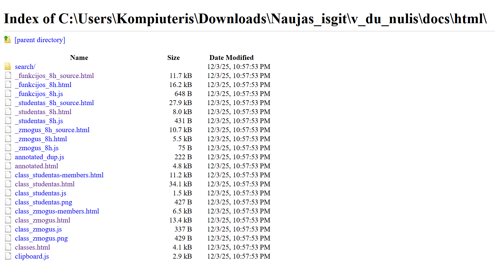
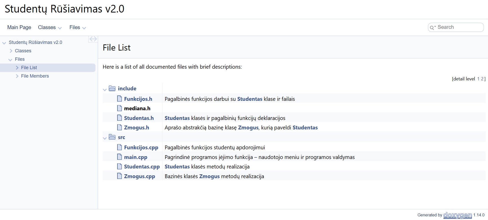
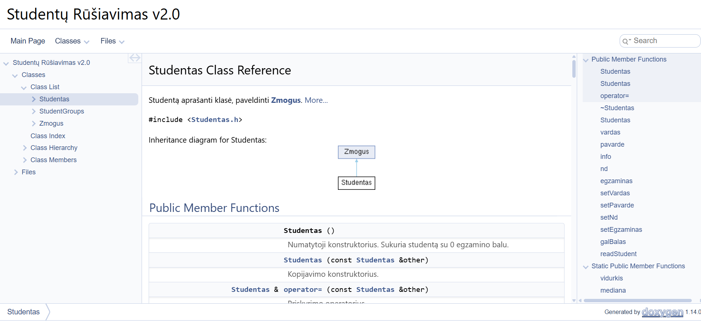
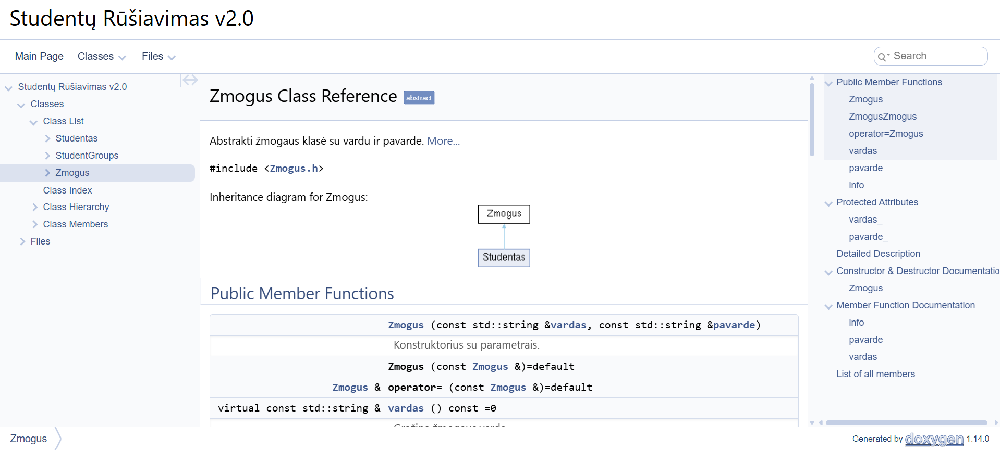

# Studentų Rūšiavimo Sistema v2.0

Ši programa leidžia:
- nuskaityti studentų duomenis,
- skaičiuoti jų galutinius balus (pagal medianą arba vidurkį),
- rūšiuoti ir skirstyti studentus į *kietiakius* ir *vargšiukus*,
- generuoti atsitiktinius testinius failus,
- atlikti automatinį našumo testavimą (iki 1 mln. studentų),
- naudoti **paveldėjimą** (`Zmogus` → `Studentas`),
- naudoti **Rule of Three** ir strategijos šabloną galutinio balo skaičiavimui,
- automatiškai generuoti dokumentaciją su **Doxygen**,
- paleisti vienetų testus (**Catch2**) su CTest.

---

## Naudojamos technologijos

| Funkcija | Sprendimas |
|---------|------------|
| Dokumentacija | **Doxygen** |
| Vienetų testai | **Catch2 + CTest** |
| Kodo organizavimas | **CMake** |
| OOP principai | Paveldėjimas, Rule of Three, polimorfizmas |
| Strategijos šablonas | Pasirenkamas balo skaičiavimo metodas |

---

## Programos architektūra

### `Zmogus` (abstrakti klasė)
- Turi `vardas_`, `pavarde_`
- Abstraktūs metodai: `vardas()`, `pavarde()`, `info()`
- Pagrindas paveldėjimui

### `Studentas` (paveldi Zmogus)
- Laiko:
  - namų darbų pažymius
  - egzamino balą
- Implementuoja:
  - **Rule of Three** (copy ctor, assignment operator, destructor)
  - strategijos funkciją: `galBalas(strategy)`
  - `readStudent()` – skaito duomenis iš failo arba interaktyviai

### Pagalbinės funkcijos (`Funkcijos.h/.cpp`)
- studentų rūšiavimas
- failų generavimas
- rezultatų išvedimas
- padalinimas į grupes
- našumo testavimas

---

## Programos paleidimas

### **1. Sukurkite build katalogą**

mkdir build
cd build

### **2. Sugeneruokite projektą su CMake**

cmake -G "MinGW Makefiles" ..

### **3. Sukompiliuokite**

cmake --build .

### **4. Paleiskite programą**

./class_vector.exe

---

## Testų paleidimas

Testų failas: `tests/test_studentas.cpp`

### **Paleidimas:**

Iš `build/` aplanko:

./studentu_tests.exe

---

## Doxygen dokumentacija

Sukurti dokumentaciją:

doxygen Doxyfile

Dokumentacija sugeneruojama į katalogą:

docs/html/index.html

Atidarykite naršyklėje:

- `C:\...\v_du_nulis\docs\html\index.html`

### Doxygen generuotos dokumentacijos pavyzdys

Čia galime matyti Doxygen dokumentaciją ir jos pagrindinius puslapius, naudojimo galimybes bei aprašymus. 
Taip atrodo Doxygen pagrindinis langas:

Galime matyti visą failų struktūrą šiame darbe

Čia matome Studento klasę:

Bei žmogaus klasę:

Taip pat galime matyti aprašytas funkcijas ir kuriose failuose jos naudojamos

---

## Pagrindinės funkcijos

### Studentų nuskaitymas iš failo  
Failo formatas:
Vardas Pavarde ND1 ND2 ... Egzaminas

### Galutinio balo skaičiavimas  

galBalas(Studentas::vidurkis)
galBalas(Studentas::mediana)

### Studentų skirstymas į grupes  
- ≥5 — *kietiakiai*
- <5 — *vargšiukai*

### Failų generavimas  

generuotiFaila(nd_count, kiekis)

---

## Atliktos OOP užduoties dalys

- Paveldėjimas iš abstraktinės bazinės klasės  
- Rule of Three  
- Strategijos šablonas  
- APK testai naudojant Catch2  
- CMake projektas  
- Automatinė dokumentacija  
- Rikiavimas ir padalijimas  
- Veikimo laiko matavimas

---

## Išvados

Projektas pilnai atitinka visus reikalavimus:

- tvarkinga architektūra
- aiškiai išskaidytas kodas
- dokumentacija
- testai
- našumo analizė
- veikia doxygen internete
