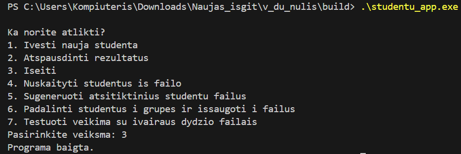
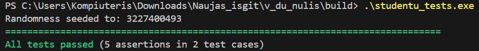
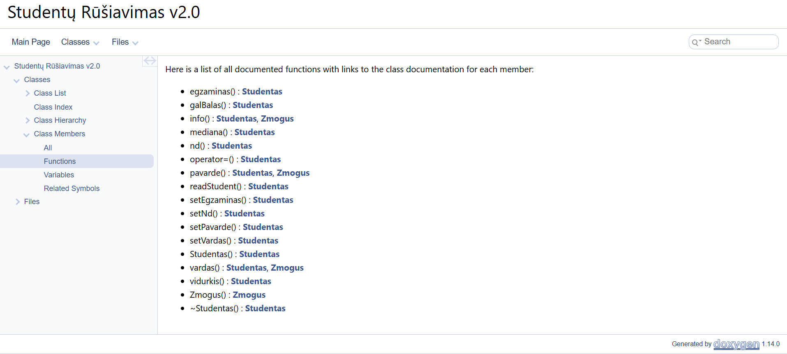
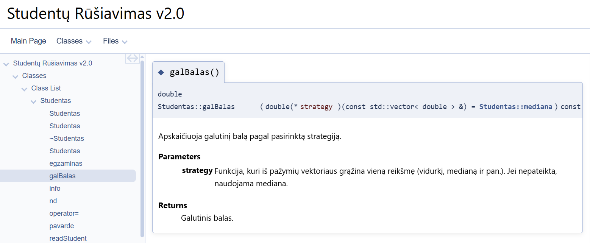

# Studentų Rūšiavimo Sistema v2.0

Ši programa leidžia:
- nuskaityti studentų duomenis,
- skaičiuoti jų galutinius balus (pagal medianą arba vidurkį),
- rūšiuoti ir skirstyti studentus į *kietiakius* ir *vargšiukus*,
- generuoti atsitiktinius testinius failus,
- atlikti automatinį našumo testavimą (iki 1 mln. studentų),
- naudoti **paveldėjimą** (`Zmogus` → `Studentas`),
- naudoti **Rule of Three** ir strategijos šabloną galutinio balo skaičiavimui,
- automatiškai generuoti dokumentaciją su **Doxygen**,
- paleisti vienetų testus (**Catch2**) su CTest.

---

## Releasų istorija

| Versija | Šaka / release | Pagrindiniai pakeitimai | Komentarai apie rezultatus |
|--------|----------------|-------------------------|----------------------------|
| v0.1   | `v0.1`         | Pirmoji pilnai veikianti versija su struktūra ir `std::vector`. | Ši versija suformavo meniu ir bazinę programos logiką. |
| v0.2   | `v0.2`         | Sugeneruoti dideli testiniai failai (1 000 – 10 000 000 įrašų), įdiegta skirstymo į „vargšiukus“ ir „kietiakius“ logika. | Leido įvertinti, kaip keičiasi trukmė didėjant įrašų skaičiui. |
| v0.3   | `v0.3`         | Pirmas veikiantis sprendimas su struktūra ir `std::vector`/`std::list`. Skaitymas iš failo, rikiavimas, skirstymas į dvi grupes, bazinis veikimo laiko matavimas. | Parodė, kad sprendimas korektiškai veikia su nedideliais failais, bet didėjant įrašų skaičiui pasimatė našumo problemos. |
| v1.0   | `v1.0`         | Kodo sutvarkymas, atskirti įvesties/išvesties ir logikos moduliai, aiškesnė projekto struktūra. | Pagerėjo kodo skaitomumas ir lengviau atlikti pakeitimus bei testuoti atskiras dalis. |
| v1.1   | `v1.1`         | Našumo optimizavimas (rezervuojama atmintis, atsisakyta nereikalingų kopijų, pagerintas skirstymo algoritmas). Atlikti detalūs laiko matavimai skirtingo dydžio failams. | Matavimai parodė, kad po optimizacijų ženkliai sumažėjo rikiavimo ir skirstymo laikas, o skaitymas iš failo išliko dominuojanti dalis. |
| v1.2   | `v1.2`         | Pereita prie klasės `Studentas`, realizuotas **Rule of Three** (kopijavimo konstruktorius, priskyrimo operatorius, destruktorius). | Patikrinta, kad kopijavimas ir priskyrimas veikia korektiškai, programa stabiliai veikia su didesniais duomenų kiekiais. |
| v1.5   | `v1.5`         | Įvesta abstrakti bazinė klasė `Zmogus`, iš jos paveldima `Studentas`. Pritaikytas paveldėjimas ir polimorfizmas. | Kodo struktūra tapo lengviau plečiama (ateityje būtų paprasta pridėti kitų tipų „žmones“ – dėstytojus ir pan.). Funkcionalumas išliko toks pats, bet OOP požiūriu kodas tapo tvarkingesnis. |
| v2.0   | `v2.0`         | Pridėta Doxygen dokumentacija (HTML), sukonfigūruotas CMake projektas (biblioteka + vykdomoji programa), įdiegti vienetų testai su Catch2, sutvarkytas README su instrukcijomis ir nuotraukomis. | Vienetų testai rodo, kad pagrindinės funkcijos (`galBalas`, skirstymas, getter'iai/setter'iai) veikia teisingai. Doxygen tinklalapyje aiškiai matoma klasės struktūra ir funkcijų aprašymai. `v2.0` yra galutinė, pilnai sukomplektuota versija. |

## Naudojamos technologijos

| Funkcija | Sprendimas |
|---------|------------|
| Dokumentacija | **Doxygen** |
| Vienetų testai | **Catch2 + CTest** |
| Kodo organizavimas | **CMake** |
| OOP principai | Paveldėjimas, Rule of Three, polimorfizmas |
| Strategijos šablonas | Pasirenkamas balo skaičiavimo metodas |

---

## Programos architektūra

### `Zmogus` (abstrakti klasė)
- Turi `vardas_`, `pavarde_`
- Abstraktūs metodai: `vardas()`, `pavarde()`, `info()`
- Pagrindas paveldėjimui

### `Studentas` (paveldi Zmogus)
- Laiko:
  - namų darbų pažymius
  - egzamino balą
- Implementuoja:
  - **Rule of Three** (copy ctor, assignment operator, destructor)
  - strategijos funkciją: `galBalas(strategy)`
  - `readStudent()` – skaito duomenis iš failo arba interaktyviai

### Pagalbinės funkcijos (`Funkcijos.h/.cpp`)
- studentų rūšiavimas
- failų generavimas
- rezultatų išvedimas
- padalinimas į grupes
- našumo testavimas

---

## Programos paleidimas

### **1. Sukurkite build katalogą**

mkdir build
cd build

### **2. Sugeneruokite projektą su CMake**

cmake -G "MinGW Makefiles" ..

### **3. Sukompiliuokite**

cmake --build .

### **4. Paleiskite programą**

.\studentu_app.exe

---

### **Paleidimas:**

Iš `build/` aplanko:

.\studentu_tests.exe  paleidžia testus
.\studentu_app.exe  paleidžia meniu su galimybėmis

### Kokius rezultatus gauname?
Pagrindinis programos meniu su visomis prieinamomis funkcijomis.

Paleidus testavimus matome, kad visi parengti vienetų testai įvykdyti sėkmingai

“All tests passed (5 assertions in 2 test cases)” rodo, kad abu testai
ir visi 5 patikrinimai davė teisingus rezultatus – pagrindinės funkcijos veikia taip,
kaip tikimasi.

## Doxygen dokumentacija

Sukurti dokumentaciją:

doxygen Doxyfile

Dokumentacija sugeneruojama į katalogą:

docs/html/index.html

Atidarykite naršyklėje:

- `C:\...\v_du_nulis\docs\html\index.html`

### Doxygen generuotos dokumentacijos pavyzdys

Čia galime matyti Doxygen dokumentaciją ir jos pagrindinius puslapius, naudojimo galimybes bei aprašymus. 
Taip atrodo Doxygen pagrindinis langas:

Galime matyti visą failų struktūrą šiame darbe

Čia matome Studento klasę:

Bei žmogaus klasę:

Taip pat galime matyti aprašytas funkcijas ir kuriose failuose jos naudojamos

Toliau matome funkcijos `galBalas()` veikimą - parodoma pati funkcija ir aprašomas jos tikslas.

---

## Pagrindinės funkcijos

### Studentų nuskaitymas iš failo  
Failo formatas:
Vardas Pavarde ND1 ND2 ... Egzaminas

### Galutinio balo skaičiavimas  

galBalas(Studentas::vidurkis)
galBalas(Studentas::mediana)

### Studentų skirstymas į grupes  
- ≥5 — *kietiakiai*
- <5 — *vargšiukai*

### Failų generavimas  

generuotiFaila(nd_count, kiekis)

---

## Atliktos OOP užduoties dalys

- Paveldėjimas iš abstraktinės bazinės klasės  
- Rule of Three  
- Strategijos šablonas  
- APK testai naudojant Catch2  
- CMake projektas  
- Automatinė dokumentacija  
- Rikiavimas ir padalijimas  
- Veikimo laiko matavimas

---

## Išvados

Projektas pilnai atitinka visus reikalavimus:

- tvarkinga architektūra
- aiškiai išskaidytas kodas
- testai paleidžiami be klaidų
- galima našumo analizė
- Doxygen dokumentacija pasiekiama kaip HTML tinklalapis
