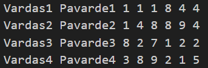
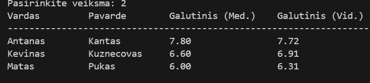
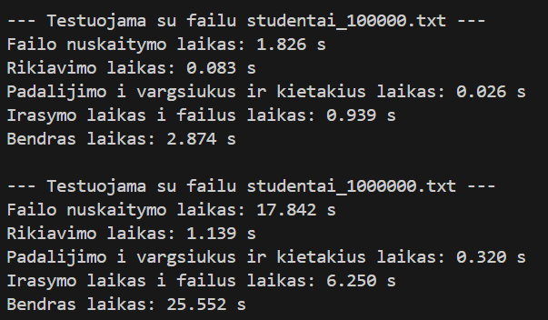

# Studentų Rūšiavimo Sistema — v1.2  

---

## Aprašymas
 
Dabartinėje versijoje `Studentas` yra pilnai įgyvendintos **class** funkcijos:

- Pilnai įgyvendinta **Rule of Three**
- Pridėti perkrauti įvesties/išvesties operatoriai
- Aiškiai apibrėžti getter/setter metodai
- Skaitymas iš vartotojo ir failo
- Strategijos metodas galutinio balo skaičiavimui (vidurkis / mediana)
- Darbas su dideliais duomenų failais: skaidymas, rūšiavimas, rašymas į failą

---

# Studentas klasė

## Rule of Three

| Metodas | Paskirtis |
|--------|-----------|
| `Studentas(const Studentas& other)` | Kuria naują objekto kopiją |
| `Studentas& operator=(const Studentas& other)` | Priskiria vieno objekto reikšmes kitam |
| `~Studentas()` | Destruktorius |

---

## Perkrauti operatoriai

### operator >>
Leidžia skaityti studentą iš:

- vartotojo (`std::cin`)
- failo (`std::ifstream`)

### operator <<  
Leidžia:

- išvesti studentą į ekraną
- išvesti studentą į failą (`std::ofstream`)

---

# Įvesties režimai

### 1. Rankinė įvestis  
Vartotojas įveda:

- vardą  
- pavardę  
- pažymius (su galimybe nurodyti kiek / įvesti nežinant kiek)  
- egzamino pažymį  

### 2. Automatinė pažymių generacija  
Sistema sugeneruoja:

- atsitiktinius namų darbų pažymius  
- atsitiktinį egzamino rezultatą  

### 3. Skaitymas iš failo  

Pirmi skaičiai - nd pažymiai, paskutinis skaičius – egzaminas.

---

# Išvestis

Programoje galima išvesti studentus:

- į terminalą
- į failus: `kietiakiai_.txt`, `vargsiukai_.txt`

Išvesties formatas:

## v1.1 testavimo rezultatai

#### Pateikiami rezultatai su šimtu tūkstančiu ir milijonu studentų laikais

| Failas           | Nuskaitymas | Rikiavimas | Padalijimas | Įrašymas | **Bendras laikas** |
|------------------|-------------|------------|-------------|----------|---------------------|
| studentai_100000 | 1.8058 s    | 0.4484 s   | 0.0518 s    | 0.7406 s | **3.0464 s**        |
| studentai_1000000| 18.1778 s   | 5.8564 s   | 0.6142 s    | 6.1636 s | **30.8118 s**       |

## v1.2 testavimo rezultatai

#### Pateikiami rezultatai su šimtu tūkstančiu ir milijonu studentų laikais

| Failas             | Nuskaitymas | Rikiavimas | Padalijimas | Įrašymas | **Bendras laikas** |
|--------------------|-------------|------------|-------------|----------|---------------------|
| studentai_100000   | 1.759 s     | 0.085 s    | 0.028 s     | 0.738 s  | **2.610 s**         |
| studentai_1000000  | 17.687 s    | 1.038 s    | 0.303 s     | 6.910 s  | **25.938 s**        |

## Išvados

- v1.2 testavimas veikia greičiau nei v1.1
- Didžiausią laiko dalį užima Nuskaitymas bei įrašymas
- darbe tinkamai realizuoti kopijavimo konstruktorius, kopijavimo operatorius bei destruktorius
