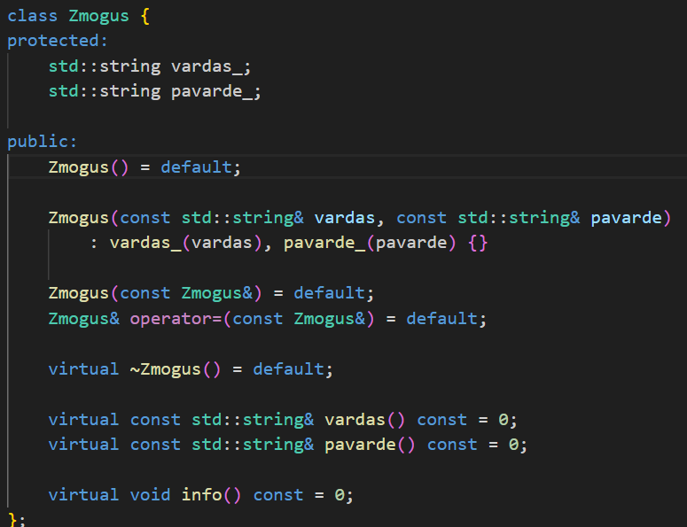
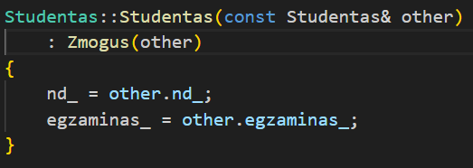
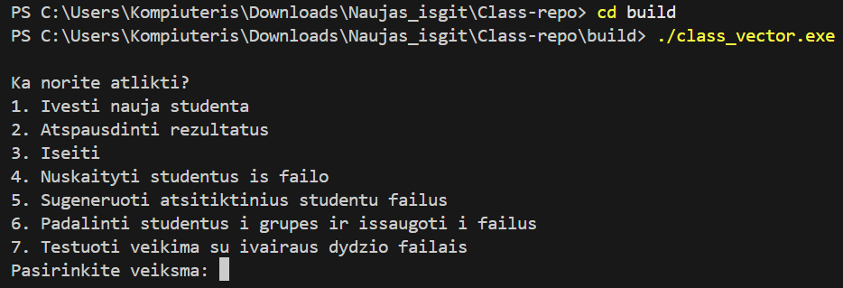
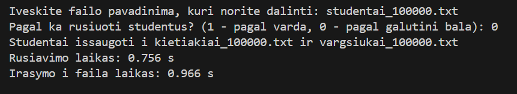

# Studentų Rūšiavimo Sistema — v1.5

## Projekto aprašymas

v1.5 versijoje projektas išplečiamas objektinio programavimo paveldėjimu, kartu išlaikant visą v1.2 funkcionalumą (skaitymas, strategijos, rikiavimas, skirstymas, testavimas, rule of three).

Pagrindinis šios versijos tikslas – įvesti abstrakčią klasę `Zmogus` ir pritaikyti paveldėjimą klasėje `Studentas`, kad projekto struktūra būtų aiškesnė ir lengviau plečiama.

---

## v1.5 nauji pakeitimai

### Abstrakti bazinė klasė `Zmogus`

Sukurta nauja klasė `Zmogus`, kuri aprašo bendrus žmogaus duomenis:

- vardas
- pavarde

Klasė yra **abstrakti**, nes turi grynai virtualius metodus, kuriuos privalo įgyvendinti paveldinčios klasės:

    virtual const std::string& vardas() const = 0;
    virtual const std::string& pavarde() const = 0;
    virtual void info() const = 0;

---

### `Studentas` paveldi iš `Zmogus`

Klasė `Studentas` dabar:

- paveldi vardas_ ir pavarde_ iš `Zmogus`
- įgyvendina abstrakčius metodus vardas(), pavarde(), info()
- išsaugo visą v1.2 funkcionalumą:

  - skaitymą iš vartotojo ir failo
  - strategijas (vidurkis, mediana)
  - galutinio balo skaičiavimą
  - operatorius `>>` ir `<<`
  - darbą su dideliais failais ir testavimą

---

## Išlikusi v1.2 programos logika

Nors v1.5 keičia projekto struktūrą (įvedama bazinė klasė ir paveldėjimas), funkcionalumas išlieka toks pats kaip v1.2 versijoje.

Programa vis dar leidžia:

- įvesti studentų duomenis rankiniu būdu
- generuoti atsitiktinius pažymius
- nuskaityti studentus iš failo
- apskaičiuoti galutinį balą naudojant:
  - mediana
  - vidurkį
- surūšiuoti ir suskirstyti studentus į:
  - „kietiakus“
  - „vargšiukus“

  

- išvesti rezultatus:
  - į terminalą
  - į failus `kietiakiai_*.txt`, `vargsiukai_*.txt`

---

### Naudojimosi instrukcija

- Atsidaryk Visual Studio code
- Atsidaryk terminalą
- Padaryk mkdir build ir tada cd build
- Paleisk mingw32-make
- Tada jau galėsi paleisti \Studentai_vector.exe, kuris paleis kodą vectoriaus konteineriui.

## v1.5 pakeitimų santraukos lentelė

| Pakeitimas                  | Aprašymas                                                       |
|----------------------------|-----------------------------------------------------------------|
| Nauja klasė `Zmogus`       | Abstrakti bazinė žmogaus klasė                                 |
| Paveldėjimas               | `Studentas` paveldi `Zmogus` (public paveldėjimas)             |
| Rule of Three atnaujinta   | Kopijuojama ir bazinė, ir išvestinė klasė                      |
| Getteriai tinkamai perrašomi    | Efektyvūs `const std::string&` getteriai                       |
| Struktūra aiški          | Aiškesnis OOP dizainas, lengviau pridėti naujas klases         |
| išlikusi  v1.2 logika      | Skaitymas, strategijos, testavimai veikia kaip v1.2 versijoje |

---

## Išvados

- v1.5 versijoje sėkmingai pritaikytas **paveldėjimas** ir **abstrakti bazinė klasė**.
- `Studentas` klasė paveldi `Zmogus` ir išlaiko visą v1.2 logiką.
- Projekto struktūra tapo aiškesnė, labiau atitinka OOP principus ir yra lengviau plečiama.
- Užduoties reikalavimai dėl abstrakčios klasės, paveldėjimo ir Rule of Three yra įvykdyti.
